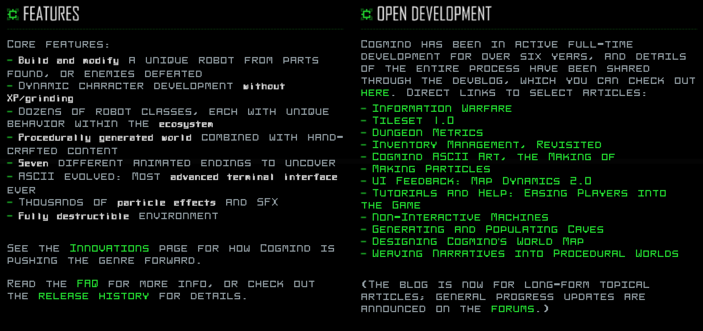

# CogFont

TrueType and Webfont version of [Cogmind](https://www.gridsagegames.com/cogmind/) in-game fonts. Now two variants "Cog" and "Smallcaps" are available!

## CDN

```html
<link rel="stylesheet" href="https://cogmind-cdn.plasticheart.info/cogfont.css" />
```

### Usage

```html
<!DOCTYPE html>
<html>
    <head>
        <link rel="stylesheet" href="https://cogmind-cdn.plasticheart.info/cogfont.css" />
    </head>
    <body>
        <div style="font-family: cogmind-cog;">Hello, Cogmind!</div>
        <div style="font-family: cogmind-smallcaps;">Hello, Cogmind!</div>
    </body>
</html>
```

----

## Screenshot



----

## License

MIT License (You need not to report use of these fonts)

- (C) 2020-2022 Grid Sage Games
- (C) 2020-2022 PlasticHeart

----

## Contact

- Twitter: [@PLHRT](https://twitter.com/PLRT)
- Discord: [@PlasticHeart#9169](https://discord.gg/Hq8wPcs)
